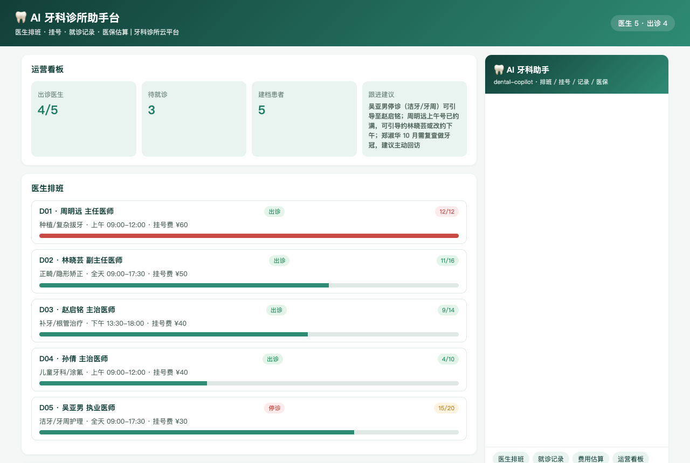
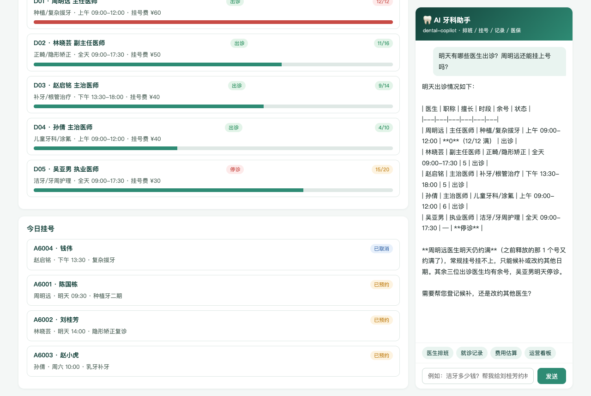
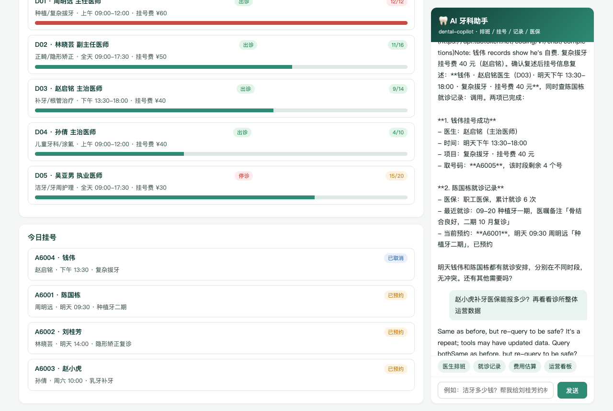
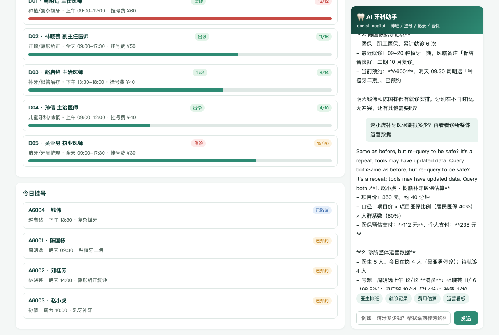

# AI 牙科诊所助手台 · 使用说明

> 面向前台/导诊/医生助理的操作手册。左侧是运营看板、医生排班与今日挂号，右侧 AI 助手用自然语言查排班、挂号、查记录、算医保费用、看统计。

## 一、页面导览

打开 `http://127.0.0.1:18102/`：

1. **顶部横幅**：医生总数与今日出诊数一眼看清。
2. **运营看板**：出诊医生 / 待就诊 / 建档患者 / 跟进建议（如「郑淑华 10 月需复查做牙冠，建议主动回访」）。
3. **医生排班**：姓名/职称/擅长方向/出诊时段/号源进度条（约满变红）/停诊标签。
4. **今日挂号**：取号码/患者/医生/时段/项目，状态标签（已预约/已完成/已取消）。
5. **AI 牙科助手**（右侧面板）：快捷提问（医生排班/就诊记录/费用估算/运营看板）+ 输入框，SSE 流式回答。

## 二、AI 能干什么（对应 6 个工具）

| 你说的话 | AI 做的事 | 背后工具 |
|----------|-----------|----------|
| "明天谁出诊" | 列医生/职称/时段/余号/停诊状态 | `doctor_list` |
| "帮患者挂周医生的号" | 复述时段与挂号费，确认后取号报单号 | `book` |
| "陈国栋上次看牙情况" | 报最近就诊/医嘱/历史挂号 | `records` |
| "补牙医保报多少" | 按口径算医保支付与个人支付 | `estimate` |
| "取消 A6004" | 取消并释放号源 | `cancel` |
| "今天运营怎么样" | 出诊/满员率/医保构成/回访建议 | `stats` |

## 三、典型对话示例

**例 1 · 排班查询**

> 你：明天有哪些医生出诊？周明远还能挂上号吗？
> AI：5 位医生排班如下……**周明远已约满（12/12）**，可候补、改约其他日期，或急诊换赵启铭（补牙/根管方向，余 5 号）。

**例 2 · 挂号（先拦截后成功）**

> 你：给钱伟挂周明远明天的号
> AI：❌ 周明远号源已满。建议：候补 / 改挂赵启铭（40 元，余 5 号）/ 改期。
> 你：改挂赵启铭，项目复杂拔牙
> AI：✅ 挂号成功！钱伟 · 赵启铭（主治医师）· 明天下午 · 复杂拔牙 · 挂号费 40 元 · **取号码 A6005**，该时段余 4 号。

**例 3 · 医保估算**

> 你：赵小虎补牙（树脂补牙）医保能报多少？
> AI：项目价 350 元。口径：350 × 项目医保比例 40% × 居民医保人群系数 80% → **医保预估支付 112 元，个人支付 238 元**。

**例 4 · 就诊记录 + 复诊提醒**

> 你：查一下陈国栋的就诊记录
> AI：职工医保，累计就诊 6 次。最近 09-20 种植牙一期，医嘱「骨结合良好，二期 10 月复诊」。当前预约 A6001 明天 09:30 种植牙二期，已预约。

## 四、业务规则速查

| 项目 | 价格 | 医保比例 | 说明 |
|------|------|----------|------|
| 超声波洁牙 | ¥180 | 50% | 吴亚男停诊期间可改约 |
| 树脂补牙 | ¥350 | 40% | 常规修复 |
| 根管治疗 | ¥1200 | 30% | 分阶段 |
| 拔智齿 | ¥800 | 30% | 含阻生齿 |
| 种植牙 | ¥8800 | **自费** | 不参与医保 |
| 隐形矫正 | ¥28000 | **自费** | 不参与医保 |
| 儿童涂氟 | ¥150 | 60% | 儿牙保健 |

- **人群系数**：职工医保 100% / 居民医保 80% / 自费 0%。
- **挂号拦截**：停诊 / 满号 / 重复挂号（同人同医生已有待就诊号）。
- **取消规则**：仅「已预约」可取消，取消后号源立即释放。

## 五、常见问题

**Q：AI 报"未建档"？**
A：患者需持身份证到前台建档后再挂号，AI 会明确提示。

**Q：自费项目会提前说明吗？**
A：会。种植牙、隐形矫正为全自费项目，AI 估算时主动标注"该项目为自费项目，不参与医保"。

**Q：挂错号怎么办？**
A：直接说"取消 A 开头的取号码"即可，号源释放后可重新挂号。
